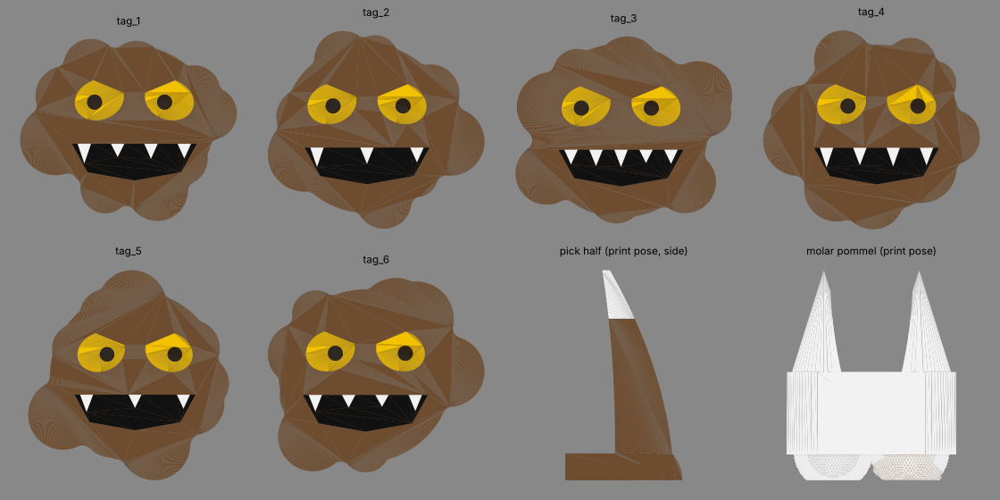

# Cavity Creep costume: Bambu A1 mini + AMS lite

You are the villain of the Tooth / Tooth Fairy / Dentist / Cavity group: a decay monster who tags the Tooth and gets chased off by the Dentist.

## The group gag
- **Decay tags (×6):** angry 75 mm splotches with a magnet in the back. You "infect" the Tooth by slapping them onto their costume. The Dentist pulls them off. The Tooth Fairy collects them.
- **Tooth's side:** sew 6 to 10 more 10×3 mm magnets, or 25 mm steel fender washers, inside the Tooth costume where the tags should land. Steel washers are easier because polarity doesn't matter.
- **Pickaxe:** your mining tool. The pommel is a molar with a cavity already drilled in it, your trophy.
- **Antennae:** germ stalks with green bulbs that slide onto a cheap plastic headband.

## Parts (`stl/`)

| Part | Files | Colors | Print pose |
|---|---|---|---|
| Decay tag ×6 | `tag_N_brown/yellow/black/white` | 4 (AMS) | Face up; inlays are the top 1 mm only |
| Pickaxe head ×2 halves | `pickaxe_head_{left,right}_{brown,white}` | 2 | Standing on the flat cut face, 165 mm tall |
| Molar pommel | `pommel_molar_{white,brown}` | 2 | Chewing face down, roots up |
| Antennae ×2 | `antenna_{left,right}_{brown,green}` | 2 | Upright, headband slot on the bed side |

Every part was checked to fit the 180 mm build volume and is watertight. To change any dimension, edit the tunables at the top of `generate.py` and run `python3 generate.py` again (`pip install trimesh shapely manifold3d`).

## Bambu Studio
1. **Multi-color import:** drag all color files of one part in together and click **Yes** on "load as a single object with multiple parts". Then assign filaments in the Objects list.
2. **AMS lite slots:** 1 Brown (matte) · 2 White · 3 Black · 4 Yellow. Swap Yellow for Green when you print the antennae.
3. **Tags:** 0.20 mm layers. All 6 fit on one plate. The colors only change in the top 5 layers, so purge waste stays small. Turn on *Flush into object's infill*. The magnet pockets face the bed, so glue the magnets in with CA after printing. Mark the polarity so every tag sticks the same way round.
4. **Pickaxe halves:** 4 walls, 15% gyroid, brim on. The half-round dowel channel sits on the bed as an arch, which prints without supports (expect a little sag at the very top that the epoxy fills). The white enamel tip only swaps color near the top. Assemble with two 6 mm × 40 mm dowel pins plus epoxy on the cut faces, then epoxy the handle in.
5. **Pommel:** no supports. The roots' cones are self-supporting.
6. **Antennae:** 0.16 mm layers, tree supports under the bulb overhang only, brim on.

Filament: about 300 g brown, 65 g white, and a few grams each of black, yellow, and green. Expect about 15 to 18 h total, most of it the pickaxe halves.

## Hardware (about $20)
- 1" (25.4 mm) wooden dowel, 36 in, for the handle. Paint it dark brown or wrap it in grip tape.
- 2× 6 mm × 40 mm dowel pins, 5-minute epoxy
- 6× 10×3 mm N52 magnets for the tags, plus magnets or steel washers for the Tooth
- Plastic headband 5 to 7 mm wide
- **Outfit:** brown or black hoodie, brown face paint with a yellow stain around the mouth, and miner's work gloves. A cheap LED headlamp works too: "mining" teeth is very on brand.
